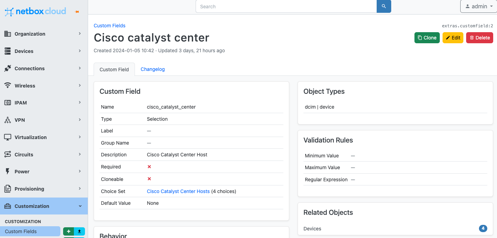
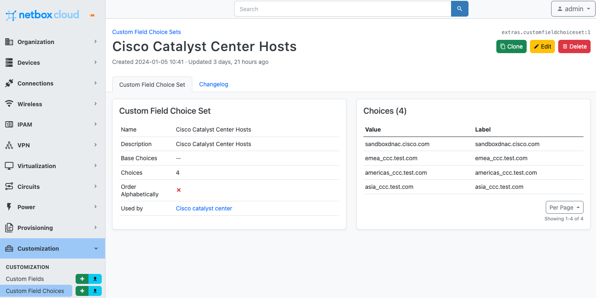
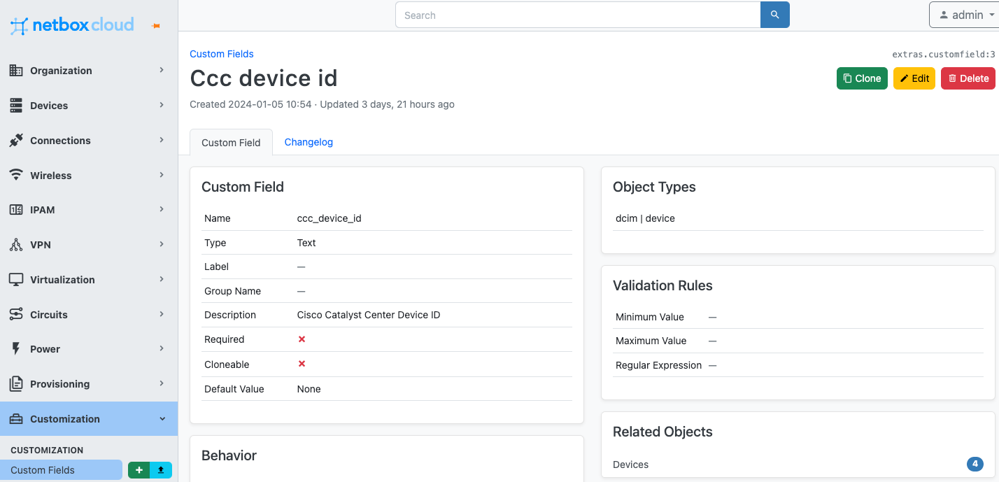
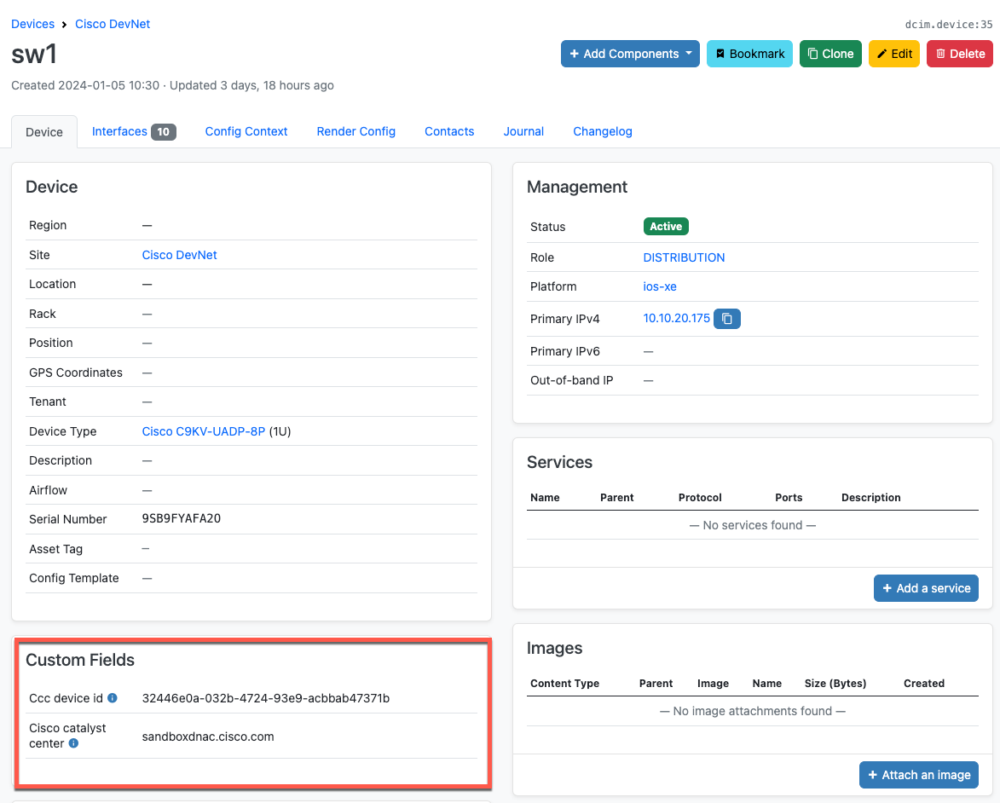

# Integrating NetBox and Ansible with Catalyst Center and Meraki as part of a modern Network Automation Architecture

A simple NetBox integration that shows how to automate devices managed by Cisco Catalyst Center and Meraki Cloud Controllers with Ansible.

This solution was presented by Rich Bibby at Cisco Live Las Vegas 2024 in the Cisco U. Theater - **Session ID CISCOU-2039**.

## Integration Overview

### Cisco Catalyst Center

The four main elements of the integration are as follows:

1. The NetBox data model is extended by adding two [Custom Fields](https://docs.netbox.dev/en/stable/customization/custom-fields/) to the `devices` model:

- Custom Field 1 is called `cisco_catalyst_center`, and is a `Selection` type field that maps to the hostname of the Cisco Catalyst Center controller:

    

    The Custom Field makes use of a `Choice Set` called `Cisco Catalyst Center Hosts` which is a drop-down menu of available Catalyst Center hosts:

    

- Custom Field 2 is called `ccc_device_id`, and is a `Text` type field that maps to the device UUID in the Cisco Catalyst Center controller

    

2. Devices managed by the Cisco Catalyst Center are added to NetBox and the device data includes the custom field values:

    

3. The [NetBox Inventory Plugin for Ansible](https://docs.ansible.com/ansible/latest/collections/netbox/netbox/nb_inventory_inventory.html) is used to dynamically generate the inventory from NetBox to be used in the Ansible playbook:

    ```
    # ansible.cfg

    [defaults]
    inventory = ./netbox_inv.yml
    ```

    ```
    # netbox_inv.yml

    plugin: netbox.netbox.nb_inventory
    validate_certs: False
    group_by:
     - device_roles
     - sites
    ```

4. The Ansible playbooks target hosts based on the `device_roles` as defined in NetBox and pulled from the dynamic inventory. They contain a `set_facts` task to map the values of the `ccc_device_id` and `cisco_catalyst_center` custom fields to the devices, so they can be used in later tasks per inventory device:

    ```
    ---
    - name: Get Device Details From Cisco Catalyst Center
      hosts: device_roles_distribution, device_roles_access
    ```

    ```
    tasks:
        - name: Set Custom Fields as Facts for Cisco Catalyst Center host and Device UUID
        set_fact:
            cisco_catalyst_center: "{{ hostvars[inventory_hostname].custom_fields['cisco_catalyst_center'] }}"
            ccc_device_id: "{{ hostvars[inventory_hostname].custom_fields['ccc_device_id'] }}"
    ```

    ```
    - name: Get Device Details
      uri:
        url: "https://{{ cisco_catalyst_center }}/dna/intent/api/v1/network-device/{{ ccc_device_id }}"
        method: GET
        return_content: yes
        validate_certs: no
        headers:
          Content-Type: "application/json"
          x-auth-token: "{{ login_response.json['Token'] }}"
      register: device_details
      delegate_to: localhost
    ```

### Cisco Meraki Cloud Dashboard

For Meraki devices we don't need to extend the NetBox data model, we can make use of the `serial mumber` field in the `device` model to map to the Meraki device serial number:


## Getting Started with the Ansible Playbooks

1. Clone the Git repo and change into the `netbox-ansible-cisco-cc` directory:
    ```
    git clone https://github.com/netboxlabs/netbox-learning.git
    cd netbox-learning/CLUS-2024-CISCOU-2039
    ```
2. Create and activate Python 3 virtual environment:
    ```
    python3 -m venv ./venv
    source venv/bin/activate
    ```
3. Install required Python packages:
    ```
    pip install -r requirements.txt
    ```
4. Set environment variables for the NetBox API token and URL, plus the Meraki Cloud Dashboard API token:
    ```
    export NETBOX_API=<YOUR_NETBOX_URL> (note - must include http:// or https://)
    export NETBOX_TOKEN=<YOUR_NETBOX_API_TOKEN>
    export MERAKI_DASHBOARD_API_KEY=<YOUR_MERAKI_TOKEN>
    ```
5. List the devices and host variables retrieved from NetBox using the dynamic inventory:
    ```
    ansible-inventory -i netbox_inv.yml --list
    ```
6. Note how the Custom Fields `ccc_device_id` and `cisco_catalyst_center` and their values are retrieved for each device:
    ```
    "sw4": {
        "ansible_host": "10.10.20.178",
        "custom_fields": {
            "ccc_device_id": "826bc2f3-bf3f-465b-ad2e-e5701ff7a46c",
            "cisco_catalyst_center": "sandboxdnac.cisco.com"
        },
    ```
7. Run a playbook making sure to specify the NetBox dynamic inventory with the `-i` flag. For example:
    ```
    ansible-playbook -i netbox_inv.yml set_meraki_mgnt_ip.yml
    ```
8. When you have finished working you can deactivate the Python virtual environment:
    ```
    deactivate
    ```

## References
- [NetBox Offical Docs](https://docs.netbox.dev/en/stable/)
- [NetBox Inventory Plugin for Ansible](https://docs.ansible.com/ansible/latest/collections/netbox/netbox/nb_inventory_inventory.html)
- [Cisco Catalyst Center API Docs](https://developer.cisco.com/docs/dna-center/2-3-7/)
