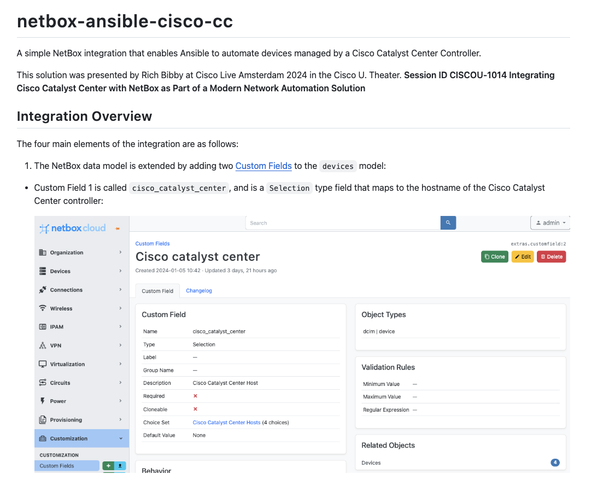

<!--- Do not edit this file directly, generated from a file in .tempaltes --->

# NetBox learning resources
> Resources, tutorials and demos for NetBox from [NetBox Labs](https://www.netboxlabs.com/).

## 🧑🏻‍🏫 Tutorials and webinars

### Exploring the Red Hat Ansible Certified Collection for NetBox

[README.md](netbox-ansible-collection-quick-start/README.md)

The Red Hat Ansible Certified Collection for NetBox enables networking teams to leverage NetBox as the dynamic inventory for Ansible Automation Platform automation jobs. Learn how this workflow not only streamlines network operations, but also enables network automations to more consistently apply to the correct infrastructure, enhancing reliability, accuracy and ultimately, network performance, while accelerating the operations of networking and infrastructure teams.

What you will learn:

- An overview of the Red Hat Ansible Certified Content Collection for NetBox modules
- How the Collection fits within modern network automation architecture frameworks
- Core uses cases for the collection, including network state management, network dynamic inventory, and querying and returning elements from NetBox.

### Getting Started with Network Test Automation: NetBox + pyATS + Genie

[README.md](netbox-pyats-webinar/README.md)

Learn how to get started with network test automation using NetBox, pyATS and Genie.

- Introduction to NetBox, pyATS and Genie: Discover what each of these amazing tools can do and how they fit together in a modern network automation solution.
- Using NetBox as a Dynamic Inventory Source for pyATS: Learn how to integrate NetBox with pyATS for efficient testbed file creation.
- Automated Network Testing: Learn how to get started validating your network state by automating some simple pre and post change network testing.

### Netbox <> Cisco Catalyst Centre integration with Ansible

[README.md](netbox-ansible-cisco-cc/README.md)

A simple NetBox integration that enables Ansible to automate devices managed by a Cisco Catalyst Center Controller.

This solution was presented by Rich Bibby at Cisco Live Amsterdam 2024 in the Cisco U. Theater. Session ID `CISCOU-1014` Integrating Cisco Catalyst Center with NetBox as Part of a Modern Network Automation Solution

### Getting Started with Network Automation: NetBox and Ansible

[README.md](netbox-ansible-webinar/README.md)

This webinar teaches you how to get started with network automation using NetBox and Ansible. This session is tailored for network professionals eager to start automating their networks using these powerful and widely-used tools.

### Getting Started with Nornir and NetBox for Network Automation

[README.md](nornir-netbox-webinar/README.md)

This webinar shows you how to get started on your Network Automation journey with Nornir and NetBox and features the `nornir_netbox` inventory plugin for Nornir.

## 🚛 NetBox OSS releases

- [v4.1-beta1 - 2024-08-05](https://github.com/netbox-community/netbox/releases/tag/v4.1-beta1) 🌟
- [v4.0.8 - 2024-07-26](https://github.com/netbox-community/netbox/releases/tag/v4.0.8)
- [v4.0.7 - 2024-07-09](https://github.com/netbox-community/netbox/releases/tag/v4.0.7)
- [v4.0.6 - 2024-06-24](https://github.com/netbox-community/netbox/releases/tag/v4.0.6)
- [v4.0.5 - 2024-06-06](https://github.com/netbox-community/netbox/releases/tag/v4.0.5)

## 📝 Latest blog articles

- [NetBox Branching is Now Available in Public Beta](https://netboxlabs.com/blog/netbox-branching-public-beta/) by Mark Coleman.
- [A New Look For NetBox and NetBox Labs](https://netboxlabs.com/blog/new-look-netbox-and-netbox-labs/) by Kiley Nichols.
- [Announcing NetBox 4.1 Beta With a Host of Features and Enhancements](https://netboxlabs.com/blog/netbox-4-1-beta-features-enhancements/) by Jeremy Stretch.
- [Using Diode and the Diode Agent to Accelerate Device Discovery With NetBox](https://netboxlabs.com/blog/using-diode-and-the-diode-agent-to-accelerate-device-discovery-with-netbox/) by Richard Boucher.
- [Technology Showcase: Deploying Multi-node Clusters with NetBox Enterprise](https://netboxlabs.com/blog/technology-showcase-deploying-multi-node-clusters-with-netbox-enterprise/) by Kris Beevers.

## Youtube videos

- [July 2024 NetBox Community Call](https://www.youtube.com/watch?v=_nFgv4ixoUE) Learn what new features are coming for NetBox and watch a demo presentation from Eric Pearce, IT Systems Architect at Nutanix.... 

- [Webinar  Device Configuration Deep Dive](https://www.youtube.com/watch?v=GZIOENxf7cU) Device Configuration is the perennial network automation example but once you scratch the surface things quickly become complicated.

In this panel session Mark Coleman and Rich Bibby from NetBox Labs... 

- [NetBox Automation Heroes - Kriten.io - Scaling Network Automation without the Trouble](https://www.youtube.com/watch?v=u3QPMFkeFmI) NetBox Automation Heroes is a video series inspired by the Netbox and network automation communities.

In Episode 3, Mark Coleman, Chief Evangelist of NetBox Labs, is joined by Steve Corp, Vlad Kupriy... 

- [Webinar New Security and Efficiency Enhancements in NetBox Cloud](https://www.youtube.com/watch?v=KOFfNfN2VgY) This insightful webinar covers the latest NetBox Cloud Platform features designed to enhance both the security and efficiency of your network management.

The webinar includes:

A guided tour of the N... 

- [ServiceNow ITSM Workflow Integration with NetBox for NetBox Labs Customers](https://www.youtube.com/watch?v=0F47R1gnp90) Watch this demo to learn how to leverage NetBox Enterprise or NetBox Cloud’s data and automation capabilities to enrich ServiceNow ITSM workflows, such as incident and change management, asset managem... 

## Get involved

Join the discussion in the [NetBox Learning Channel](https://netdev-community.slack.com/archives/C0453L6565C) on the NetDev Community Slack! If you aren't already a member then you can sign up for free [here](https://netdev.chat/).

Join the [NetBox Community](https://netboxlabs.com/join-the-netbox-community/)