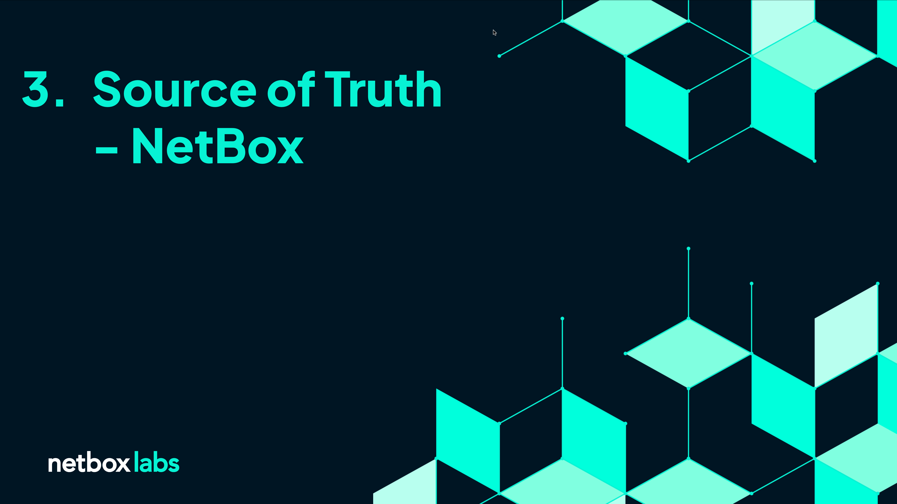

# Section 3 - NetBox - Our Network Source of Truth

## Video Guide (Click to launch :rocket:)

___

A Network Source of Truth like [NetBox](https://netboxlabs.com/) is the bedrock of any network automation stategy. NetBox acts as your living documentation and captures the Low Level Design of your network, but initially our NetBox is empty (apart from a some pre-configured objects, which you can ignore for now.)

Please refer to the video above for this section.

> [!TIP]
> **NetBox URL**: `./0_set_envvars.sh | grep -i netbox`  
> **username** admin  
> **password** admin  

> [!TIP]
> 
> If you're interested in learning more about NetBox check out the [NetBox Zero to Hero course](https://netboxlabs.com/zero-to-hero/)  
> It's packed with useful information and instructional videos to give you a deeper understanding of NetBox's capabilities

___

Next Section - [**Discovery and Reconciliation - Slurpit**](./4_Discovery_Reconciliation_Slurpit.md)
