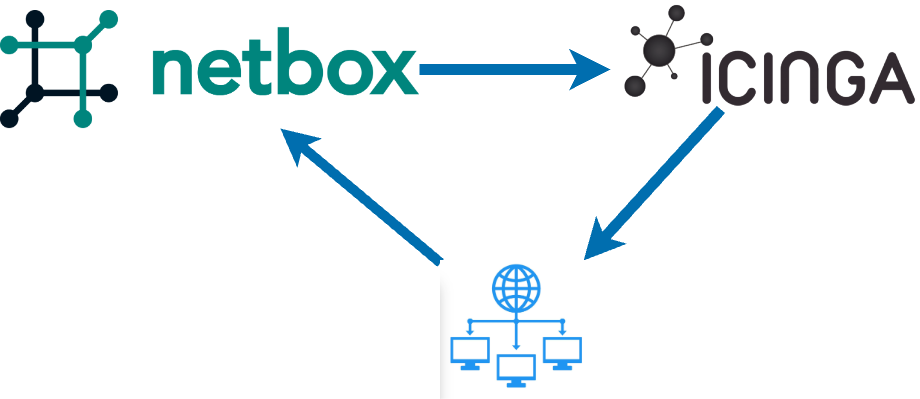

# Monitoring - Icinga

## Video Guide (Click to launch :rocket:)

---

> [!TIP]
> 
> To make sure your network is in the right state for this section, you can use the following command:  
> `./3_start_network.sh network/5.1_monitoring`  

Monitoring can be viewed as the process that checks to see if the networking is doing what it should be doing, but how do we tell the monitoring what the network should be doing? As we saw in `Section 1 - Managing Networks The Hard Way` the traditional approach is to configure the network and the monitoring separately. This works, but it requires discipline and coordination, which both cost time and energy. The reason why discipline and coordination are required is because we are duplicating data across systems: we tell a router that it's management IP is `172.168.0.1` and then we go and tell the monitoring that the router's management IP is `172.168.0.1`. The consequences of getting this wrong can be dire, and timing can be tricky.

When we're using intent based network automation we can rely on the data in NetBox, our source of truth, to make sure that both the network and the monitoring are updated correctly.

## Icinga NetBox Integration

[Icinga](https://icinga.com/) is a full featured, fully open source monitoring system, but the principles covered in this section can be applied to any monitoring system. NetBox Labs's partner [Sol1](https://sol1.com.au/) are network automation experts and Icinga power users who created an [integration](https://github.com/sol1/icingaweb2-module-netbox) between Icinga and NetBox which reduces the discipline and coordination needed to maintain accurate monitoring. The integration reads intended network state from NetBox and intelligently applies it to Icinga to create the necessary monitoring checks. The NetBox Icinga integration is battle tested and can handle many data types and edge cases, including powerful grouping functionality, so for example, SNMP settings per device type or latency per site, or NTP servers per region can all be modeled in Icinga.

> [!TIP]
> 
> This also acts as a check on the data in NetBox!  
> 
> As we saw in `Section 4 - Discovery and Reconciliation - Slurpit` whenever we see something going wrong,  
> it could be an error in the network, or it could be that our intended state is incorrect  

Lets get started!

___

## Configuring our Source of Truth

In order for the NetBox Icinga integration to do its magic we first need to make some updates in NetBox. The integration periodically polls NetBox to check if any of the devices are in the necessary state to be imported into Icinga. This allows operators to control which devices should be monitored by editing their intended network state, and is useful for managing device lifecycles, like bringing new hardware online and scheduled downtime.

The first step is to update the device states in NetBox so that they will be imported by Icinga. Slurpit creates devices with a default status of `Inventory`. To be monitored by Icinga, their status needs to be set to `Active`.

First login to NetBox.

> [!TIP]
> **NetBox URL**: `./0_set_envvars.sh | grep -i netbox`  
> **username** admin  
> **password** admin

Navigate to `Devices -> Devices`, select both Devices and then click `Edit Selected`. Set Status to `Active`, and `the `Icinga import source` to `Default`. The click `Apply`.

> [!TIP]
> The `Icinga import source` field allows us to define diffrent "profiles" in the Icinga Director Import Sources.  

Now login to Icinga.

> [!TIP]
> **Icinga URL**: `./0_set_envvars.sh | grep -i icinga`  
> **username** icingaadmin  
> **password** icinga

Our devices are now being imported into Icinga. Once they are imported the predefined monitoring, known as `Checks`, will begin. Keep an eye on `Overview` -> `Tactical Overview`. (It can take a minute or so to see them appear.)

- INSERT SCREENSHOT OF TACTICAL OVERVIEW and explain that one of them is the Icinga host itself.

- Click on the number 3 under hosts to be taken to http://147.182.198.119:8002/icingaweb2/icingadb/hosts?host.state.soft_state=0

- INSERT SCREENSHOT OF MONITORED HOSTS

- Back on the tactical overview page, click on the GREEN 9 under services

- INSERT SCREENSHOT OF GREEN 9

- INSERT SCREENSHOT OF MONITORED SERVICES and explain what they are: http://147.182.198.119:8002/icingaweb2/icingadb/services?service.state.soft_state=0

### Workshop Specific Plugin

For this workshop, we have a special check that pings the OTHER Nokia device from each device. This is controlled by the custom field ping_target, and if you set this to the valid target, the ping will come from the nokia device itself. 

Once the device automatically imports into Icinga, you can see the checks being applied automatcaily. This incldues ping (of the primary IP), SSH, an SNMP uptime command. These Icinga Services are applied automatically when a device with the Netbox manufacturer Nokia is created as an Icinga Host. The concept of Icinga Apply Rules is very powerful, and means we can use any Netbox Data to create a dynamic and accurate set of Services.

### Bonus Other Checks

We have also included other checks in the Icinga configuration, which can check SSL certifcates, as an example. 
To try this out
1. Add a device, or virtual machine to Netbox, and set it to Active, import_source default, and it should get a ping check.
2. Add to the same Netbox device/virtual machine a service using the service template `SSL -` and set the service's Icinga list custom field a fqdn or comma seperated fqdn's, the Icinga automation will add to the hosts service that check the SSL certificate for those fqdn(s). For example, you could add a device called google, give it a valid Google IP, and setup a service for SSL with the ssl_hostname set to www.google.com, Icinga will automatically create the host and setup a service that checks the certifcate for you. 

There is much more power available to this integration, and once you realise that Netbox can drive the config of your monitoring completely, it becomes easy and sustainable.

### Notifications

As another bonus option, the Netbox Contacts can be imported, and assigned to devices or virtual machines. Using a Contact Assignment, of type 'engineer' we can effectively subscribe to alerts from this device. This gives us a powerful way of documenting the relationships between man and machine, and making sure the right person gets the right alerts.
Go ahead and add yourself as a contact, and add your email. Assign a device to yourself and try it out.

