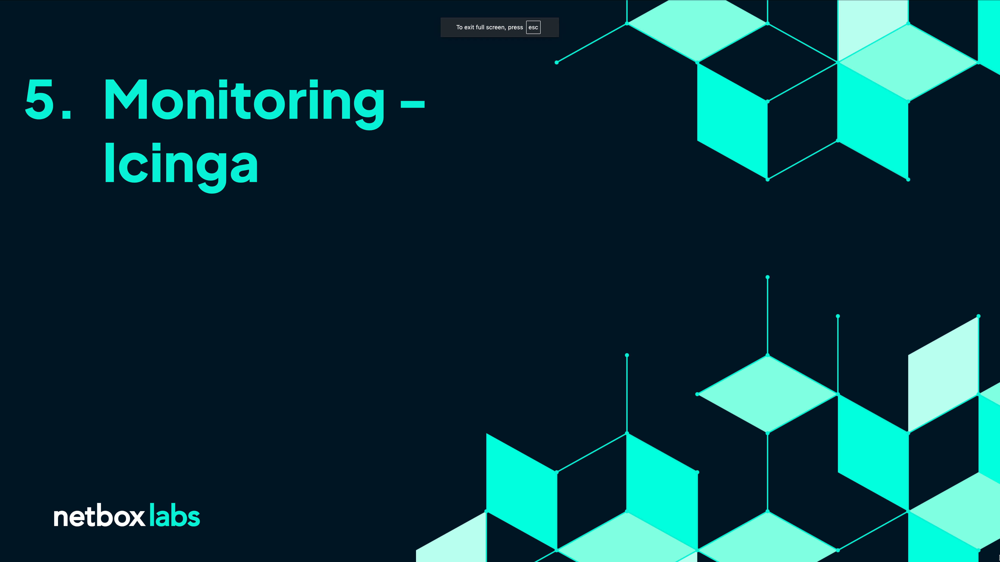
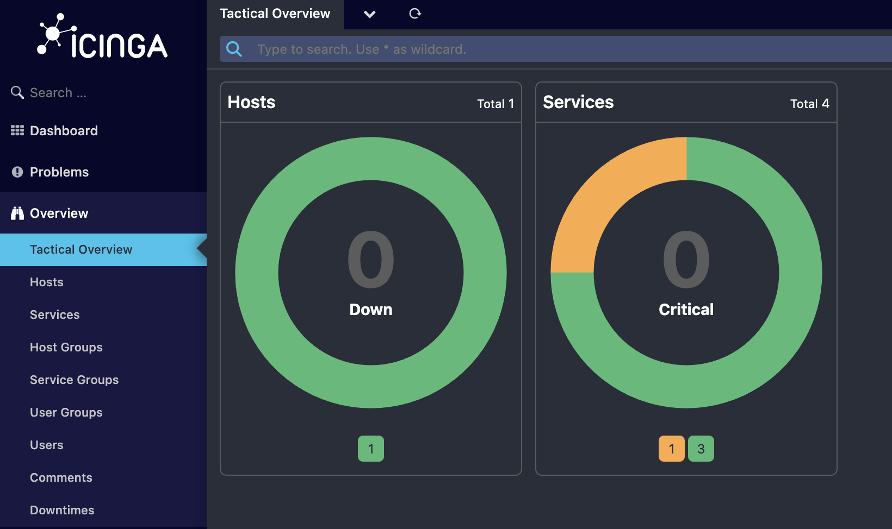
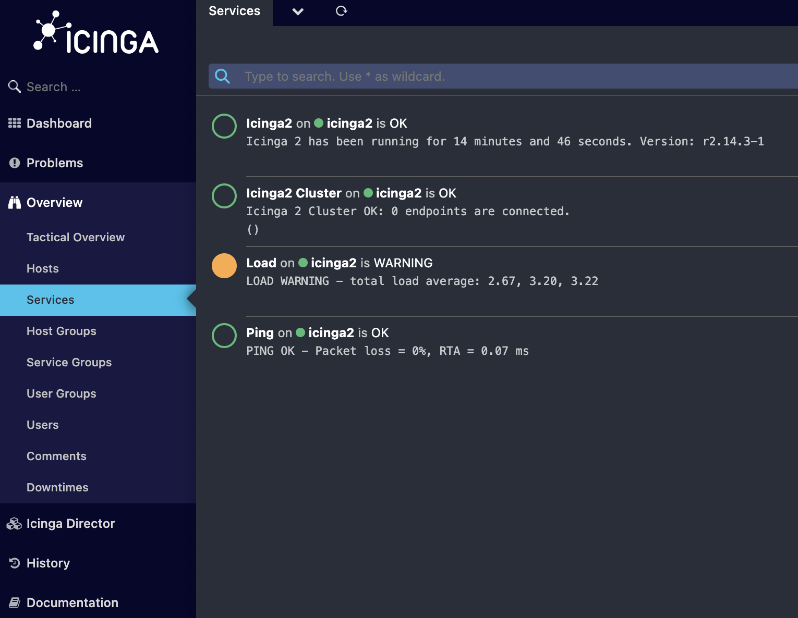
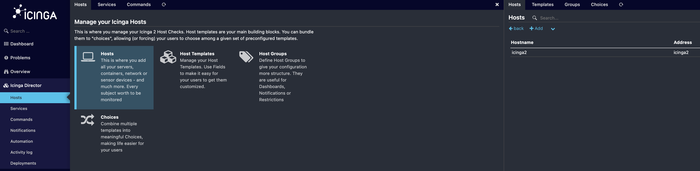
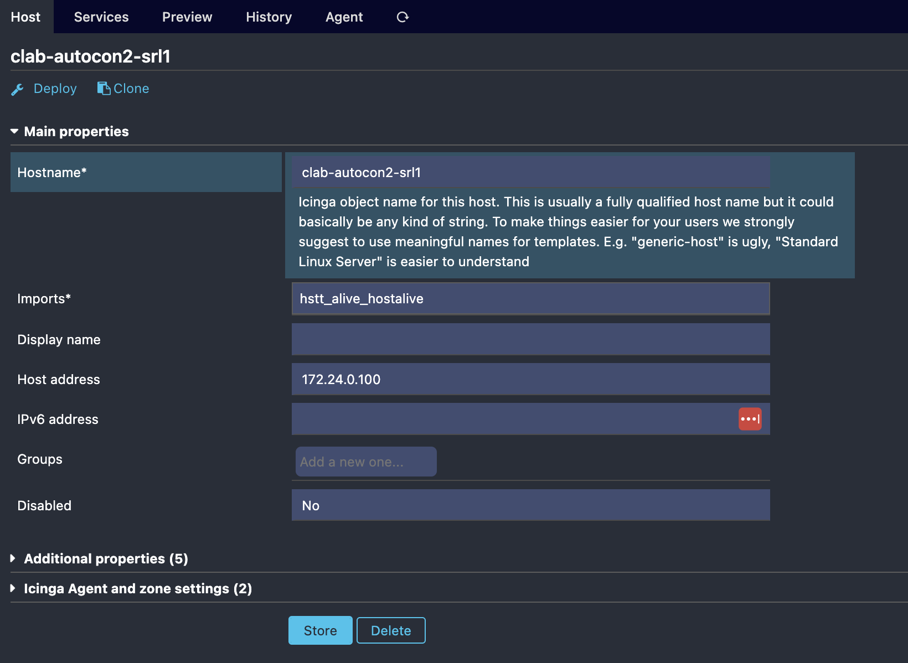
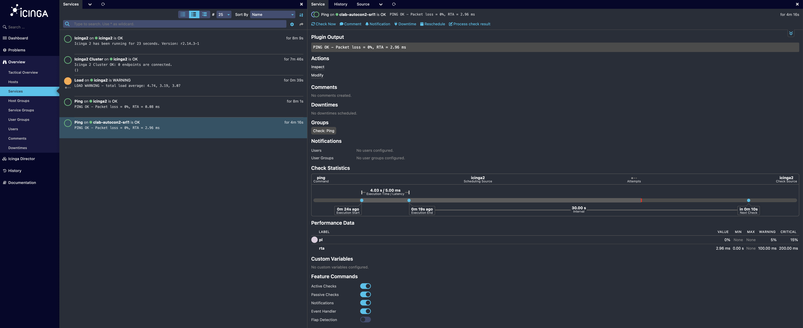
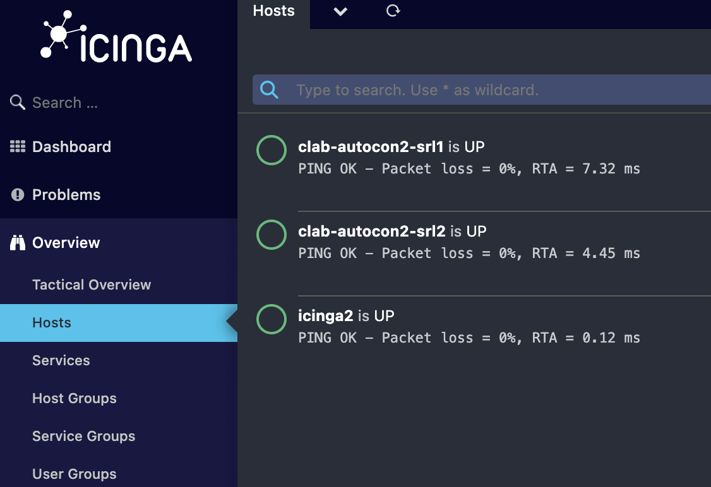

# Monitoring - Icinga

## Video Guide (Click to launch :rocket:)

___

> [!TIP]
> 
> To make sure your network is in the right state for this section, you can use the following command:  
> `./3_start_network.sh network/5.1_monitoring`  

Monitoring can be viewed as the process that checks to see if the networking is doing what it should be doing, but how do we tell the monitoring what the network should be doing? As we saw in `Section 1 - Managing Networks The Hard Way` the traditional approach is to configure the network and the monitoring separately. This works, but it requires discipline and coordination, which both cost time and energy. The reason why discipline and coordination are required is because we are duplicating data across systems: we tell a router that it's management IP is `172.168.0.1` and then we go and tell the monitoring that the router's management IP is `172.168.0.1`. The consequences of getting this wrong can be dire, and timing can be tricky.

When we're using intent based network automation we can rely on the data in NetBox, our source of truth, to make sure that both the network and the monitoring are updated correctly.

## Icinga NetBox Integration

[Icinga](https://icinga.com/) is a fully featured, open source monitoring system, but the principles covered in this section can be applied to any monitoring system. NetBox Labs's partner [Sol1](https://sol1.com.au/) are network automation experts and Icinga power users who created an [integration](https://github.com/sol1/icingaweb2-module-netbox) between Icinga and NetBox which reduces the discipline and coordination needed to maintain accurate monitoring.

The integration reads intended network state from NetBox and intelligently applies it to Icinga to create the necessary monitoring checks. The NetBox Icinga integration is battle tested and can handle many data types and edge cases, including powerful grouping functionality, so for example, SNMP settings per device type or latency per site, or NTP servers per region can all be modeled in Icinga.

> [!TIP]
> 
> This also acts as a check on the data in NetBox!  
> 
> As we saw in `Section 4 - Discovery and Reconciliation - Slurpit` whenever we see something going wrong,  
> it could be an error in the network, or it could be that our intended state is incorrect  

Lets get started!

___

## Introduction to Icinga Hosts and Services

Icinga is a powerful tool, but we're only going to focus on a subset of its capabilities to explain the key concepts of using monitoring with intent based network automation.

Let's first log in to Icinga. Click on `Overview` and then `Tactical Overview`.

> [!TIP]
> **Icinga URL**: `./0_set_envvars.sh | grep -i icinga`  
> **username** icingaadmin  
> **password** icinga 

The Tactical Overview gives us a high level summary of the current state of our monitoring which is broken down into `Hosts` and `Services`. As you might expect, the `Hosts` are the network devices, servers or VMs that we're interested in, and `Services` are the individual services on those hosts that we're monitoring. In this case Icinga is already configured with one host, the machine where we're running our workshop.

Now we will explore the preconfigured services. Click on `Overview` -> `Services`.

Here we can see that 4 service checks are configured including a `Ping` check. Now let's configure our own.

## Manually configuring a Ping check with Icinga Director

To get a feeling for the overhead introduced with manual monitoring configuration, let's configure a `Ping` check on one of our lab devices: `clab-autocon2-srl1`

To do this we will use Icinga Director, a powerful add-on for Icinga which we will later use to automatically configure our monitoring from NetBox. In the left-hand menu bar click on `Icinga Director` -> `Hosts` and then click on `Hosts` in the main window.

Then in the top right we will add our new host. Click `+ Add` and then enter the following details for the host:

- Host Template: `hstt_alive_hostname` (this will automatically populate the `Imports*` field)
- Hostname: `clab-autocon2-srl1`
- Host address: `172.24.0.100` (The management IP for `clab-autocon2-srl1`)

Then click `Add` and then click `Store`.

> [!TIP]
> When we selected the `Host Template` Icinga automatically configured the `Ping` service for the lab device  

It will take a few moments for Icinga Director to deploy the new configuration. Navigate to `Overview` -> `Tactical Overview` -> `Services` where you'll see that we now have a `ping` check running for `clab-autocon2-srl1`

Great! Our monitoring can see our lab devices. This is a lot of error prone work though, so next we'll see how we can use our network intent in NetBox to drive our monitoring configuration automatically.

Let's remove our manually configured host first. Navigate to `Icinga Director` -> `Hosts` -> `Hosts`, then click on `clab-autocon2-srl1` and then over on the right hit `Delete`.

## Driving our monitoring configuration with NetBox

In order for the NetBox Icinga integration to do its magic we first need to make some updates in NetBox. The integration periodically polls NetBox to check if any of the devices are in the necessary state to be imported into Icinga. This allows operators to control which devices should be monitored by editing their intended network state, and is useful for managing device lifecycles, like bringing new hardware online and scheduling downtime.

The first step is to update the device states in NetBox so that they will be imported by Icinga. Slurpit creates devices with a default status of `Inventory`. To be monitored by Icinga, their status needs to be set to `Active`.

First login to NetBox.

> [!TIP]
> **NetBox URL**: `./0_set_envvars.sh | grep -i netbox`  
> **username** admin  
> **password** admin  

Navigate to `Devices -> Devices`, select both Devices and then click `Edit Selected`. Set Status to `Active`, and the `Icinga import source` to `Default`. Then click `Apply`.

> [!TIP]
> The `Icinga import source` field allows us to define different "profiles" in the Icinga Director Import Sources. If you're interested you can learn more about these in the Icinga documentation.  

Now login to Icinga.

> [!TIP]
> **Icinga URL**: `./0_set_envvars.sh | grep -i icinga`  
> **username** icingaadmin  
> **password** icinga  

Our lab devices are now being imported into Icinga. Once they are imported the predefined monitoring will begin. Keep an eye on `Overview` -> `Hosts`. It can take a minute or so to see them appear, and once they do they will first appear in the `PENDING` status and then finally `UP`.

Now let's explore the monitored services. Click on `clab-autocon2-srl1` and then the `Services` tab in the right pane. Here you can see that 3 services are automatically being monitored on our devices: `Ping` for reachability to the management interface, and `SNMP` and `SSH` for management connectivity.

## Summary

We've only dipped our toes in the capabilities of the NetBox Icinga integration in this section, but you should now start to get a sense of the power we've unleashed with this way of working. By introducing NetBox as our source of truth for our network, we can now control our monitoring in Icinga right alongside our network design. This is a concept with wide reaching applications that are outside the scope of this guide, but it should be clear to see that this approach can greatly reduce the overhead and surface area for making mistakes involved when we're configuring our network monitoring.

> [!TIP]
>  
> Now that Icinga is continously monitoring NetBox for its configuration, why not try breaking the service checks?  
> Try changing the management IP on one of our lab devices to be incorrect and watch in Icinga for what happens!

_____

Next Section - [**Configuration Assurance - Netpicker**](./6_Configuration_Assurance_Netpicker.md)
