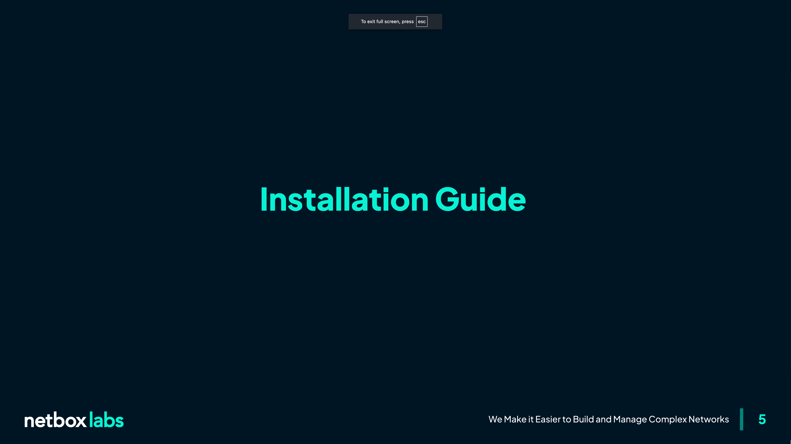

# Installation

> [!TIP]
>  
> This workshop is resource intensive. We recommend using a machine with at least 8GB of RAM and 4 cores.  

> [!TIP]
>  
> The workshop assumes it is running on an internet accessible machine and relies on the public IP  
> for a lot of the functionality. This means that it _probably_ won't work on your local machine, but we aim  
> to add that at a later stage.

> [!TIP]
>  
> The installation is easy to follow, but takes about 10 minutes

## Installation Video (Click to launch :rocket:)
[](https://www.youtube.com/watch?v=g2zW7m5dz_0)
---

## Clone the workshop

```
git clone https://github.com/netboxlabs/netbox-learning.git
cd netbox-learning/automation-zero-to-hero
```

## Set environment variables

This script sets all the necessary envirionment variables so that the correct ports are used for the services and defaults to using the public IPv4 of the host for service URLs.

```
source ./0_set_envvars.sh
```

Keep the output from this handy somewhere as we'll reference it a lot.

## Install host tooling

```
./1_install_host_tooling.sh
```

Check it was successful:

```
docker version
clab version
```

## Start Slurpit

```
./2_start_slurpit.sh
```

Now you can access Slurpit.

```
echo "http://${MY_EXTERNAL_IP}:${SLURPIT_PORT}"
(Example output, yours will differ)
http://139.178.74.171:8000

```

> [!TIP]
> 
> **username** admin@admin.com  
> **password** 12345678  

## Start the ContainerLab network

```
./3_start_network.sh network/1_the_hard_way
```

## Start NetBox with the Slurpit plugin

> [!TIP]
> This can take up to 5-6 minutes depending on your hardware. Use `docker compose logs -f` in a separate tab to follow along.  
> If you see `Error` next to the `netbox-docker-netbox-1` container this is often because the healthcheck timeout is shorter than the start up time and it will recover itself automatically.

```
./4_start_netbox.sh
```

Now you can access NetBox.

```
echo "http://${MY_EXTERNAL_IP}:${NETBOX_PORT}"
(Example output, yours will differ)
http://139.178.74.171:8001
```

> [!TIP]
>  
> **username** admin  
> **password** admin

## Start Icinga

```
./5_start_icinga.sh
```

Now you can access Icinga.

```
echo "http://${MY_EXTERNAL_IP}:${ICINGA_PORT}"
(Example output, yours will differ)
http://139.178.74.171:8002
```

> [!TIP]
>   
> **username** icingaadmin  
> **password** icinga

## Start Netpicker

```
./6_start_netpicker.sh
```

Now you can access Netpicker.

```
echo "http://${MY_EXTERNAL_IP}:${NETPICKER_PORT}"
(Example output, yours will differ)
http://139.178.74.171:8003
```

> [!TIP]
> 
> **username** admin@admin.com  
> **password** 12345678
