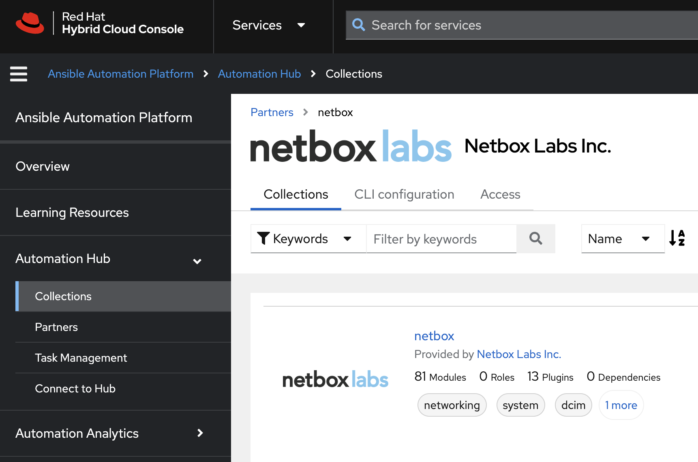

# NetBox Ansible Collection - Quick Start

A short guide to getting started with the Ansible Collection for Netbox. This repo accompanies the talks given at Cisco Live Las Vegas 2024, by the Netbox Labs and Red Hat Network Automation product teams.



The collection is available from either [Ansible Galaxy](https://galaxy.ansible.com/ui/repo/published/netbox/netbox/), or NetBox Labs and Red Hat customers can access the certified collection which is supported by both Red Hat and NetBox Labs, via [Ansible Automation Hub](https://console.redhat.com/ansible/automation-hub/repo/published/netbox/netbox/). This doc is based on the Galaxy installation and shows how to use the collection from the command line, rather than from within Ansible Automation Hub.

## Collection Overview

The NetBox Ansible project provides an Ansible collection for interacting with NetBox, the leading solution for modeling and documenting modern networks. By combining the traditional disciplines of IP address management (IPAM) and datacenter infrastructure management (DCIM) with powerful APIs and extensions, NetBox provides the ideal "source of truth" to power network automation.

This Ansible collection consists of a set of modules to define the intended network state in NetBox, along with plugins to drive automation of the network using data from NetBox.

## Requirements

- You must be running one of the two most recent releases of NetBox
- A NetBox write-enabled API token when using modules or a read-only token for the `nb_lookup ` and `nb_inventory` plugins.
- Python 3.10+
- Python modules:
  - pytz
  - pynetbox
- Ansible 2.15+

## Getting Started with the Collection

### Installation and Setup

1. Clone the Git repo and change into the `netbox-ansible-collection-quick-start` directory:
    ```
    git clone https://github.com/netboxlabs/netbox-learning.git
    cd netbox-learning/netbox-ansible-collection-quick-start
    ```
2. Create and activate Python 3 virtual environment:
    ```
    python3 -m venv ./venv
    source venv/bin/activate
    ```
3. Install Python Modules and Ansible
   ```
   pip install pytz
   pip install pynetbox
   pip install ansible
   ```
4. Install the NetBox Ansible Collection.

   Before using this collection, you need to install it with the Ansible Galaxy command-line tool:

   ```
   ansible-galaxy collection install netbox.netbox
   ```
5. Set environment variables for your NetBox API token and URL:
    ```
    export NETBOX_API=<YOUR_NETBOX_URL> (note - must include http:// or https://)
    export NETBOX_TOKEN=<YOUR_NETBOX_API_TOKEN>
    ```
## NetBox as a Dynamic Inventory Source for Ansible

The [Inventory Plugin](https://docs.ansible.com/ansible/latest/collections/netbox/netbox/nb_inventory_inventory.html) component of the collection is used to dynamically generate the inventory from NetBox to be used in Ansible playbooks.

In the example [`ansible.cfg`](ansible.cfg) file we are specifying that the inventory should be sourced from the file `netbox_inv.yml`:

 ```
 # ansible.cfg

 [defaults]
 inventory = ./netbox_inv.yml
 ```

The plugin is highly configurable in terms of defining returned hosts and groupings etc in the inventory, so please consult the [docs](https://docs.ansible.com/ansible/latest/collections/netbox/netbox/nb_inventory_inventory.html).

In this case we are grouping the returned hosts by the `device_roles` and `sites` as defined in the NetBox database:

```
 # netbox_inv.yml

 plugin: netbox.netbox.nb_inventory
 validate_certs: False
 group_by:
  - device_roles
  - sites
```

To view a graph of the inventory retrieved from NetBox, you can run the `ansible-inventory` command and use the `-i` flag to specify the `netbox_inv.yml` file as the source, followed by `--graph`:

```
ansible-inventory -i netbox_inv.yml --graph
```

From the returned output we can see that our NetBox instance has returned the data expected nd we have a few `device_roles` and `sites`:
```
@all:
  |--@device_roles_access:
  |  |--sw3
  |  |--sw4
  |--@device_roles_access_switch:
  |  |--SWITCH-1
  |--@device_roles_distribution:
  |  |--sw1
  |  |--sw2
  |--@device_roles_security_appliance:
  |  |--SEC-APP-1
  |--@device_roles_wireless_ap:
  |  |--AP-1
  |--@sites_cisco_devnet:
  |  |--sw1
  |  |--sw2
  |  |--sw3
  |  |--sw4
  |--@sites_meraki_sandbox:
  |  |--AP-1
  |  |--SEC-APP-1
  |  |--SWITCH-1
  |--@ungrouped:
```

To list all the devices in the inventory, use the same command, but with the `--list` suffix:
```
ansible-inventory -i netbox_inv.yml --list
```

The output below shows the inventory data returned for a single device, ans all of this can be used in further playbooks to automate operations against the target device:

```
"sw1": {
     "ansible_host": "10.10.20.175",
     "custom_fields": {
         "ccc_device_id": "32446e0a-032b-4724-93e9-acbbab47371b",
         "cisco_catalyst_center": "sandboxdnac.cisco.com"
     },
     "device_roles": [
         "distribution"
     ],
     "device_types": [
         "c9kv-uadp-8p"
     ],
     "is_virtual": false,
     "local_context_data": [
         null
     ],
     "locations": [],
     "manufacturers": [
         "cisco"
     ],
     "platforms": [
         "ios-xe"
     ],
     "primary_ip4": "10.10.20.175",
     "regions": [],
     "serial": "9SB9FYAFA2O",
     "services": [],
     "site_groups": [],
     "sites": [
         "cisco-devnet"
     ],
     "status": {
         "label": "Active",
         "value": "active"
     },
     "tags": []
}
```

To run a playbook that uses the dynamic inventory, specify the inventory file when you run the playbook:

```
ansible-playbook -i netbox_inv.yml <PLAYBOOK NAME>
```

To target hosts or groups from the inventory in your playbook, reference the hosts or groups as normal in the playbook:
```
---
- name: Playbook using NetBox Inventory Plugin for Ansible
  hosts: device_roles_distribution, device_roles_access
```

## Define Intended Network State in NetBox

Define the intended state of your network in NetBox, by interacting with the NetBox database to define objects and their associated state in the following ways:

- Make sure objects exit
- Update objects if they do exist
- Remove objects if they do not not exist

For example, to make sure a new aggregate network prefix exists:
```
tasks:
    - name: Create aggregate within NetBox with only required information
      netbox.netbox.netbox_aggregate:
        netbox_url: http://netbox.local
        netbox_token: thisIsMyToken
        data:
          prefix: 192.168.0.0/16
          rir: Test RIR
        state: present
```

The example playbook `populate_netbox_ipam.yml` will ensure that the `RFC1918` IPv4 aggregates exist in NetBox, as well as some predefined Prefix and VLAN Roles:
```
# populate_netbox_ipam.yml

---
- name: PLAY 1 - Create RIRs
  connection: local
  hosts: localhost
  gather_facts: False

  roles:
    - role: create_rirs
      tags: rirs

- name: PLAY 2 - Create Aggregates
  connection: local
  hosts: localhost
  gather_facts: False

  roles:
    - role: create_aggregates
      tags: aggregates

- name: PLAY 3 - Create Prefix and VLAN Roles
  connection: local
  hosts: localhost
  gather_facts: False

  roles:
    - role: create_prefix_and_vlan_roles
      tags: prefix_and_roles
```

The playbook is modularized using `roles`, for example the file [`roles/create_aggregates/tasks/main.yml`](roles/create_aggregates/tasks/main.yml) loops over the list of aggregates defined in the file [`roles/create_aggregates/vars/main.yml`](roles/create_aggregates/vars/main.yml):
```
# roles/create_aggregates/tasks/main.yml

---
- name: Create Aggregates within NetBox
  netbox.netbox.netbox_aggregate:
    netbox_url: "{{ lookup('ansible.builtin.env', 'NETBOX_API') }}"
    netbox_token: "{{ lookup('ansible.builtin.env', 'NETBOX_TOKEN') }}"
    data: "{{ aggregate }}"
    state: present
  loop: "{{ ipam_aggregates }}"
  loop_control:
    loop_var: aggregate
    label: "{{ aggregate['prefix']}}"
```

```
# roles/create_aggregates/vars/main.yml
---
ipam_aggregates:

  - prefix: 10.0.0.0/8
    rir: RFC 1918

  - prefix: 172.16.0.0/12
    rir: RFC 1918

  - prefix: 192.168.0.0/16
    rir: RFC 1918
```

## Query and Return Elements from NetBox

Use the [Lookup Plugin](https://docs.ansible.com/ansible/latest/collections/netbox/netbox/nb_lookup_lookup.html) to query NetBox and return data to drive network automation, such as lists of devices, device configurations, prefixes and IP addresses etc.

In the example playbook [`lookup_site_and_device_data.yml`](lookup_site_and_device_data.yml) we first of all query the NetBox `sites` API endpoint and then print a list of all the sites. Then we query the `devices` API endpoint, filter on the site `cisco-devnet` and print a list of the devices at that site:

```
# lookup_site_and_device_data.yml
---
- name: Lookup NetBox Site and Device Data
  hosts: localhost
  gather_facts: no

  vars:
    netbox_url: "{{ lookup('ansible.builtin.env', 'NETBOX_API') }}"
    netbox_token: "{{ lookup('ansible.builtin.env', 'NETBOX_TOKEN') }}"

  tasks:

  - name: "Query NetBox for all sites"
    set_fact:
      sites: "{{ query('netbox.netbox.nb_lookup', 'sites', api_endpoint=netbox_url, token=netbox_token) }}"

  - name: "Print the list of sites"
    debug:
      msg: "{{ sites | json_query('[*].value.name') }}"

  - name: "Query NetBox for devices at the Cisco DevNet Site"
    set_fact:
      devices: "{{ query('netbox.netbox.nb_lookup', 'devices', api_filter='site=cisco-devnet', api_endpoint=netbox_url, token=netbox_token) }}"

  - name: "Print a list of devices at Cisco DevNet Site"
    debug:
      msg: "{{ devices | json_query('[*].value.name') }}"
```

The playbook run resuts in the following output:

```

```

## References
- Collection on [Ansible Galaxy](https://galaxy.ansible.com/ui/repo/published/netbox/netbox/)
- Collection on [Ansible Automation Hub](https://console.redhat.com/ansible/automation-hub/repo/published/netbox/netbox/)
- Docs for [NetBox Inventory Plugin](https://docs.ansible.com/ansible/latest/collections/netbox/netbox/nb_inventory_inventory.html)
- Docs for [NetBox Lookup Plugin](https://docs.ansible.com/ansible/latest/collections/netbox/netbox/nb_lookup_lookup.html)
