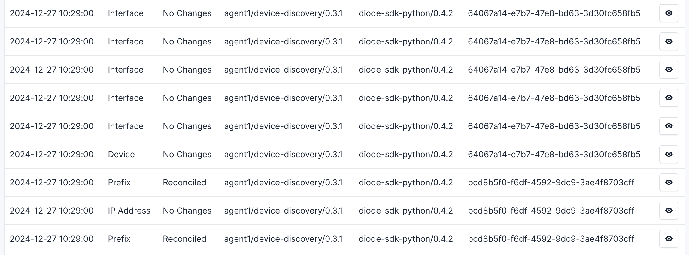
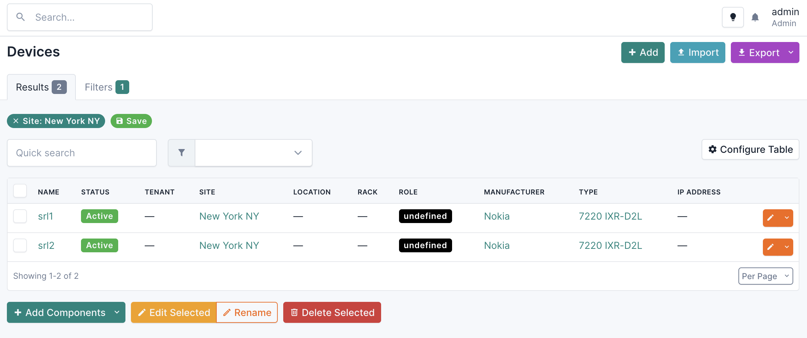
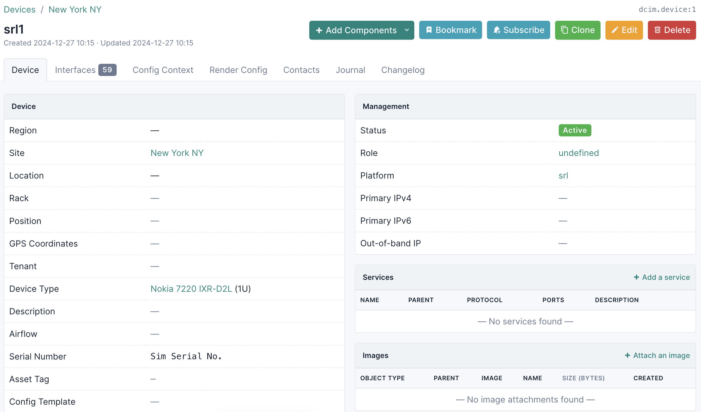
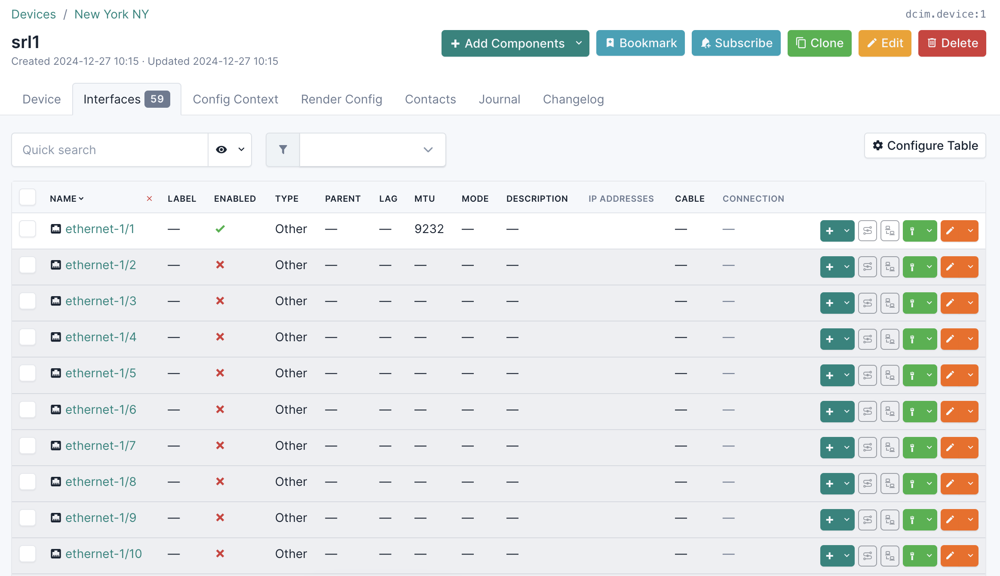
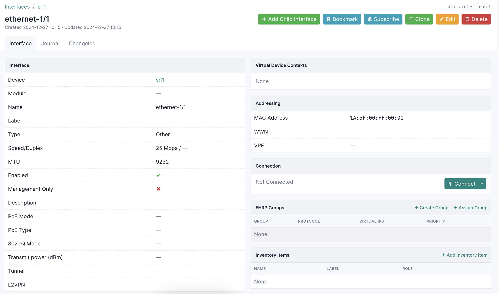

# NetBox Discovery - Quickstart

The purpose of this quickstart is to get you up and running with NetBox Discovery as quickly as possible. In a few commands you will install and pre-configure everything you need to start experimenting with NetBox Discovery:

- NetBox with the Diode Plugin
- Diode
- Lab devices in ContainerLab
- NetBox Discovery configurations

You will be able to run simple scripts to use both features of NetBox Discovery:

1. Network Diccovery
2. Device Discovery

> [!TIP]
>   
> If you hit any issues when running through this quickstart guide you can get help by posting in the #netbox channel in the NetDev Slack  
> If you don't already have an account in the NetDev Slack, you can create one here: [https://netdev.chat/](https://netdev.chat/)  

## Setup

> [!TIP]
>  
> The workshop assumes it is running on an internet accessible machine and it relies on the public IP for a lot of functionality  
> This means that **it will not work on your local machine**, but we aim to add that possibility at a later stage. Please use a cloud VM for now.    

> [!TIP]
>  
> - We recommend using a machine with at least 4GB of RAM and 2 cores. If you're going to run Cisco IOS images, you'll need at least 8GB of RAM  
> - The workshop has only been tested on Ubuntu 22.04. It _should_ work on other Linux distros but if you hit any problems please create an issue on in GitHub  
> - Unfortunately MacOS is not supported. The workshop relies heavily on ContainerLab which does not have native support for MacOS  


### Clone the repo and go to the Discovery Quickstart

```
cd /opt
git clone https://github.com/netboxlabs/netbox-learning.git
cd netbox-learning/netbox-discovery-quickstart
```

### Install the required tooling on the host and set up users

```
./0_install_host_tooling.sh
```

### Switch to the correct user

> [!TIP]
>  
> We run as a separate user so that we can correctly mount our NetBox Discovery configuration in later steps  

```
su - quickstart
```

### Generate and export the necessary environment variables for the quickstart

> [!TIP]
>   
> `1_set_envvars.sh` writes the variables it generates to a file in the root directory called `environment`  
> This is so that you can run `1_set_envvars.sh` in separate terminals and get the same results  
> If you need to recreate the envirionment variables, just delete `environment` and run the script again  

```
source 1_set_envvars.sh
```

### Start NetBox with the Diode plugin installed and configured.

> [!TIP]
>   
> NetBox runs a lot of database migrations when starting up for the first time so this can take a few minutes  

```
./2_start_netbox.sh
```

When this step finishes you can check that NetBox is working by logging NetBox using the URL and credentials provided in the command line output.

### Start Diode.

```
./3_start_diode.sh
```

### Configure NetBox to communicate with Diode

Go back to NetBox. On the left-hand menu bar navigate to `Diode` -> `Settings`. You'll see that the fields are already configured for you.


You just need to click on `Create`.

Then in the left-hand menu bar in NetBod click on `Diode` -> `Ingestion Logs` and you should see this:


Diode is now ready to start ingesting data from NetBox Discovery into our NetBox instance!

### Start the lab network

We need some lab devices to run our device discovery against and for this we will use ContainerLab.

> [!TIP]
> 
> The default lab uses two Nokia SR Linux devices because they are freely available and don't use much memory.  

> [!TIP]
> 
> There's also a single node Cisco IOS example lab but you'll need to provide your own Cisco IOS containerized image  
> You can find the ContainerLab instructions for Cisco IOS [here](https://containerlab.dev/manual/kinds/)  
> Update `network/cisco_ios/ios.clab.yml` to point it to your Cisco IOS Docker image  

```
./4_start_network.sh network/srl.clab.yml
```

After a short while you should see a summary on our ContainerLab devices, like this:

```
╭──────────────────────────────────────┬──────────────────────────────┬─────────┬────────────────╮
│                 Name                 │          Kind/Image          │  State  │ IPv4/6 Address │
├──────────────────────────────────────┼──────────────────────────────┼─────────┼────────────────┤
│ clab-discovery-quickstart-nokia-srl1 │ nokia_srlinux                │ running │ 172.24.0.100   │
│                                      │ ghcr.io/nokia/srlinux:24.7.2 │         │ N/A            │
├──────────────────────────────────────┼──────────────────────────────┼─────────┼────────────────┤
│ clab-discovery-quickstart-nokia-srl2 │ nokia_srlinux                │ running │ 172.24.0.101   │
│                                      │ ghcr.io/nokia/srlinux:24.7.2 │         │ N/A            │
╰──────────────────────────────────────┴──────────────────────────────┴─────────┴────────────────╯
```

## NetBox Discovery

NetBox Discovery has two modes: **Network Discovery** and **Device Discovery**

> [!TIP]
> 
> You can find the full NetBox Discovery documentation here: [https://docs.netboxlabs.com/netbox-discovery/](https://docs.netboxlabs.com/netbox-discovery/)  

**Network Discovery** uses `nmap` under the hood to find active IPs and ingests them into NetBox.

**Device Discovery** uses `NAPALM` under the hood to discover network device information and ingest it to NetBox.

### Network Discovery

Network Discovery has various configuration options, but for now we will focus on discovering active IPs in a subnet. In this case we will use the subnet we pre-configured for our lab devices: `172.24.0.0/24`

Before we run our network discovery, let's take a quick look at the configuration file that will be created to define the discovery behaviour.

```
orb:
  config_manager:
    active: local
  backends:
    network_discovery:
    common:
      diode:
        target: grpc://${MY_EXTERNAL_IP}:8080/diode
        api_key: ${DIODE_API_KEY}
        agent_name: agent1
  policies:
    network_discovery:
      policy_1:
        scope:
          targets:
            - ${DOCKER_SUBNET}
```

Here you can see various variables that will be populated automatically when you run the script below. Here's the most important part in which we define the `targets` for our network discovery.

```
  policies:
    network_discovery:
      policy_1:
        scope:
          targets:
            - ${DOCKER_SUBNET}
```

`targets` is a list of single IPs, an IP ranges or subnets. In this case when we run the script we will insert a single subnet for our ContainerLab devices, which as mentioned above is `172.24.0.0/24`

___

Now let's run the network discovery!

```
./5_start_network_discovery.sh
```

In our lab we have two SR Linux devices with management IPs at `172.24.0.100` and `172.24.0.101`. When we run our network discovery we should expect to find those, but also a few other IPs that are being used in our quickstart guide. You can ignore those.

Now go and take a look into NetBox under `Diode`-> `Ingestion Logs` and you should see records like this:


Now exit out of network discovery with `Ctrl+C`

### Device Discovery

Using Device Discovery we will extract information from our lab devices and then ingest that information into NetBox. Device Discovery requires that we provide some information about our devices so that connections can be established.

Let's take a look at the configuration file that will be generated for Device Discovery.

```
orb:
  config_manager: 
    active: local
  backends:
    device_discovery:
    common:
      diode:
        target: grpc://${MY_EXTERNAL_IP}:8080/diode
        api_key: ${DIODE_API_KEY}
        agent_name: agent1
  policies:
    device_discovery:
      discovery_1:
        config:
          schedule: "* * * * *"
          defaults:
            site: New York NY
        scope:
          - driver: srl
            hostname: 172.24.0.100
            username: ${SRLINUX_USERNAME}
            password: ${SRLINUX_PASSWORD}
            optional_args:
               insecure: True
          - driver: srl
            hostname: 172.24.0.101
            username: ${SRLINUX_USERNAME}
            password: ${SRLINUX_PASSWORD}
            optional_args:
               insecure: True
```

Again you can see various variables that will be populated automatically when you run the script below. Here's the most important part in which we define the devices for our network discovery.

```
        scope:
          - driver: srl
            hostname: 172.24.0.100
            username: ${SRLINUX_USERNAME}
            password: ${SRLINUX_PASSWORD}
            optional_args:
               insecure: True
          - driver: srl
            hostname: 172.24.0.101
            username: ${SRLINUX_USERNAME}
            password: ${SRLINUX_PASSWORD}
            optional_args:
               insecure: True
```

You can see that we need to provide the IPs, and SSH credentials for our lab devices. We've also used NAPALM's `optional_args` functionality to specifiy `insecure: True` which tells the NAPALM driver to skip TLS so we don't need to concern ourselves with certificates in this quickstart.

Let's go ahead and run it:

```
SRLINUX_USERNAME="admin"
SRLINUX_PASSWORD="NokiaSrl1!"
./6_start_device_discovery.sh
```

First NetBox Discovery will load the environment and the policies we've defined in our configuration. The configuration section `schedule: "* * * * *"` tells the discovery agent to run every minute, so you'll need to wait for a minute to pass for the first device discovery run to execute.

Keep an eye on the Diode ingestion logs by going to the left-hand menu in NetBox clicking on `Diode` -> `Ingestion logs`. Eventually you'll see our discovery ingestion logs show up with types including `Device`, `Prefix`, `IP Address`, and `Interface`.



> [!WARNING]  
> You may notice some failures in the ingestion logs that look like this due to a known issue in Diode. We're working on a fix.  
> `IP Address  Failed  agent1/device-discovery/0.3.0 diode-sdk-python/0.4.2  ab6b46cd-441f-4e26-aab4-7ceaab0d34db`  

You'll also notice in our configuration above that we defined the default site for devices to be `New York NY`. Go to NetBox and click on `Organization` -> `Sites` where you'll now see our `New York NY` site.

Now click on `New York NY` and then `Devices` in the right hand pane, where you will now see our devices.



Now click on the first device `srl1`. Here you can see that the `Device Type`, `Platform` and `Status` have all been set correctly.



Now click on the `Interfaces` tab for `srl1`. Now you'll see that all our our device interfaces have been successfully ingested into NetBox, with the correct administrative statuses which are called `Enabled` in NetBox.



Lastly, click on the top interface `ethernet-1/1`. Now you'll see that NetBox Discovery has correctly ingested the correct `MAC Address`, `MTU`, and `Speed/Duplex` for the interface, and also whether or not this is a management interface.



## Conclusion

In this short guide you have learned the basics of NetBox Discovery's two modes of operation: network discovery and device discovery. Feel free to play around with the environment you've created, and to fork the repo to do your own experiments with NetBox Discovery.
