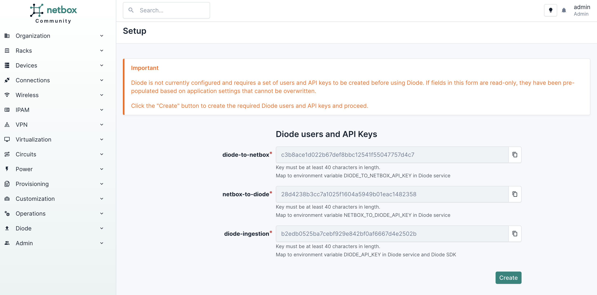
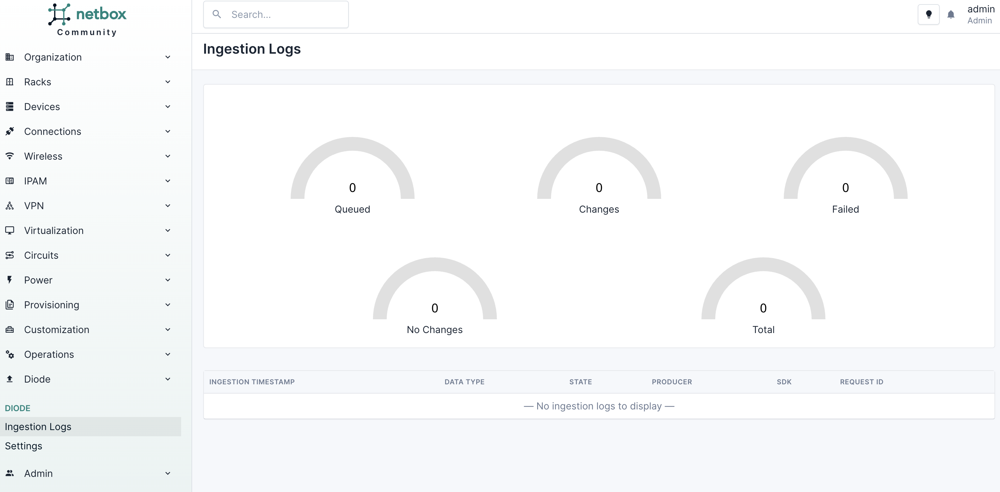
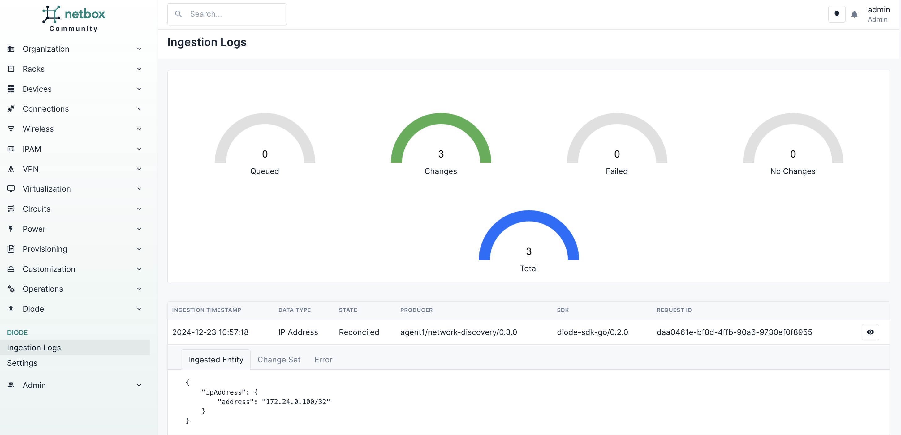

# NetBox Discovery - Quickstart

The purpose of this quickstart is to get you up and running with NetBox Discovery as quickly as possible. In a few commands you will install and pre-configure everything you need to start experimenting with NetBox Discovery:

- NetBox with the Diode Plugin
- Diode
- Lab devices in ContainerLab
- NetBox Discovery configurations

You will be able to run simple scripts to use both features of NetBox Discovery:

1. Network Diccovery
2. Device Discovery

> [!TIP]
>   
> If you hit any issues when running through this quickstart guide you can get help by posting in the #netbox channel in the NetDev Slack
>  
> If you don't already have an account in the NetDev Slack, you can create one here: [https://netdev.chat/](https://netdev.chat/)

## Setup

> [!TIP]
>  
> The workshop assumes it is running on an internet accessible machine and it relies on the public IP for a lot of functionality  
> This means that **it will not work on your local machine**, but we aim to add that possibility at a later stage. Please use a cloud VM for now.    

> [!TIP]
>  
> - We recommend using a machine with at least 4GB of RAM and 2 cores. If you're going to run Cisco IOS images, you'll need at least 8GB of RAM  
> - The workshop has only been tested on Ubuntu 22.04. It _should_ work on other Linux distros but if you hit any problems please create an issue on in GitHub  
> - Unfortunately MacOS is not supported. The workshop relies heavily on ContainerLab which does not have native support for MacOS  


### Clone the repo and go to the Dicovery Quickstart.

```
git clone https://github.com/netboxlabs/netbox-learning.git
cd netbox-learning/netbox-discovery-quickstart
```

### Generate and expport the necessary environment variables for the quickstart.

> [!TIP]
>   
> Make a note of the output of this step as you'll need it later on

```
source 0_set_envvars.sh
```

### Install the required tooling on the host.

```
./1_install_host_tooling.sh
```

### Start NetBox with the Diode plugin installed and configured.

```
./2_start_netbox.sh
```

When this step finishes log-in to NetBox using the provided URL and credentials.

### Start Diode.

```
./3_start_diode.sh
```

### Configure NetBox to communicate with Diode

Go back to NetBox. On the left-hand menu bar navigate to `Diode` -> `Settings`. You'll see that the fields are already configured for you.



You just need to click on `Create`. Then left-hand menu bar click on `Diode` -> `Ingestion Logs` and you should see this:



### Start the lab network

We need some lab devices to run our discovery on and for this we will use ContainerLab.

> [!TIP]
> 
> The default lab uses two Nokia SR Linux devices because they are freely available and don't use much memory.  
> There's also a single node Cisco IOS example lab (`network/ios.clab.yml`) but you'll need to provide your own Cisco IOS containerized image  
> You can find the ContainerLab instructions for Cisco IOS [here](https://containerlab.dev/manual/kinds/)
> Update `network/cisco_ios/ios.clab.yml` to point it to your Cisco IOS Docker image

```
./4_start_network.sh network/srl.clab.yml
```

## NetBox Discovery

NetBox Discovery has two modes: Network Discovery and Device Discovery

> [!TIP]
> 
> You can find the full NetBox Discovery documentation here: [https://docs.netboxlabs.com/netbox-discovery/](https://docs.netboxlabs.com/netbox-discovery/)  

- **Network Discovery** uses Nmap under the hood to find active IPs and ingests them into NetBox.
- **Device Discovery** uses NAPALM under the hood to discovery information about network devices and ingest it to NetBox.

### Network Discovery

Network Discovery has various configuration options, but for now we will focus on discovering active IPs in a subnet. In this case we will use the subnet we pre-configured for our lab devices: `172.24.0.0/24`

INSERT MORE INFORMATION HERE ABOUT THE DEVICES WE EXPECT TO FIND ONCE WE HAVE FIXED THE SRLINUX ISSUES

Run network discovery:

```
./5_start_network_discovery.sh
```

Our Nokia SR Linux devices are pre-configured to expose their management interfaces on `172.24.0.100` and `172.24.0.101`, so we should now see those IPs in the ingestion logs in NetBox.

Now go and take a look into NetBox under `Diode`-> `Ingestion Logs` and you should see records like this:



Now exit out of network discovery with `Ctrl+C`

### Device Discovery


## TODO:

- Device discovery isn't working for Nokia SR Linux
  - Make an issue for the unuseful error output. Example: Specify the wrong napalm driver name (napalm-srl instead of srl) and it fails with an message about EOF in 
- Try IOS as the happy path next
  - The devices come up suspiciously fast
  - The IOS devices haven't got IP addresses from clab yet
- Is it possible to remove everything from the docker network and have it still work?

the config
- You should have created all of this on a fork because now you can't commit it....

> [!TIP]
>   
> INSERT TIP HERE  